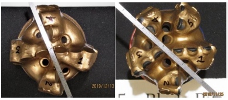
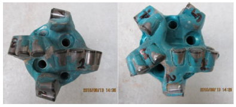
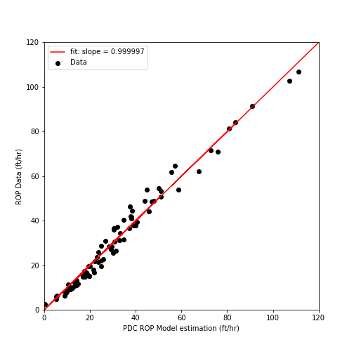
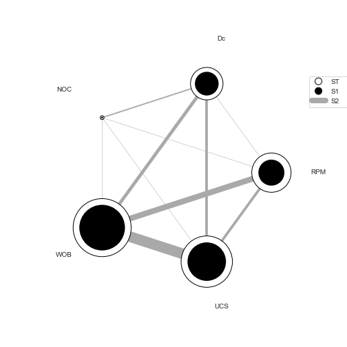

# Developing PDC ROP model using symbolic regression algorithm

A PDC ROP model was developed using symbolic regression algorithm. 

* In this study, we use the Sandia National Lab and National Oil Varco full PDC bit data.
* The data was published in ARMA conference 55TH US ROCK MECHANICS / GEOMECHANICS SYMPOSIUM 18-25 June 2021 Online.
* Paper title is "ROP Model for PDC Bits in Geothermal Drilling". Please check out the Paper in the Paper folder.

### Symbolic Regression Algorithm

The symbolic regression algorithm uses the genetic algorithm concept to develop mathematical equations for provided data points.
The algorithm begins a pool of mathematical equations (Hall of fame) in the shape of the tree. The fitness of each tree is calculated and it is used for developing the next generation of trees applying genetic mutation and crossover operators. 


### Python library

The PySR library is used in this study. check out the PySR website [here](https://pysr.readthedocs.io/en/latest/docs/getting-started/).


### Repository structure

```
├───Archive
├───Data
├───Figures
├───Images
└───Paper
```

### Bits 


PDC bits manufactured by National Oil Varco - NOV (left) and Ulterra (right) are seen at the following image.
<p align="left">
  
  
</p>

### Data
The four-row of data used in this study are seen in the following table.

###### Table
```
|   year | name       |     WOB |   ROP data |   Db |   RPM |   UCS |   NOC |   BR |   SR |   Dc |   NOB |
|--------|------------|---------|------------|------|-------|-------|-------|------|------|------|-------|
|   2019 | SWG        | 2543.8  |    6.2     | 3.75 |    80 | 28000 |    11 |   25 |    1 | 0.51 |     4 |
|   2019 | SWG        | 3048.9  |   11.9     | 3.75 |    80 | 28000 |    11 |   25 |    1 | 0.51 |     4 |
|   2019 | SWG        | 3538.7  |   19.5     | 3.75 |    80 | 28000 |    11 |   25 |    1 | 0.51 |     4 |
|   2019 | SWG        | 4066.2  |   28.6     | 3.75 |    80 | 28000 |    11 |   25 |    1 | 0.51 |     4 |
```
###### Data Dimensions
```
WOB is in lbf
ROP data is in ft/hr
Db is in inch
RPM is in rpm
UCS is in psi
NOC is dimensionless
BR is dimensionless
Dc is in inch
NOB is dimensionless
```
### Results

The following equation was found using symbolic regression algorithm.
```
ROP = (pow((((((RPM + 98.457596) / Dc) * WOB) / (UCS - WOB)) - NOB) - NOC, 1.1348255) * 0.31298584)
```
The following figure compares the data versus above ROP model (found by AI).


<p align="center">
  
</p>

### Suggestions

* The Pysr clearly ignores the dimensionality of mathematical equations. The PySR guides the searching processes toward those equations which result in higher accuracy.
* It would be beneficial if the ML algorithm (symbolic regression package) comes with new feathers to consider the dimensionality in the process of evolution.
* One method that can be used for dimensionality consideration in PySR is by using a customized loss function. In such a case, it is suggested to develop a function that can measure the normalized behavior of separate input parameters into the dependant parameter. The influence of independent parameters on dependant parameters can be studied separately using lab data or from literature. For instance, there is almost an agreement that the WOB affects the ROP with power bigger than 1. Note that this is true before achieving the flounder point. Once the customized objective function was prepared, it is expected that the PySR incorporate more physics into developing equations.
* The sensitivity analysis package in this study was used. As it is seen in the above graph, the PySR found that the WOB, RPM, and UCS have a bigger effect on ROP compare to Dc and NOC.
* The results can be affected by the available number of data points too.
* Beside the effect of independent parameters in dependant, One should consider the interaction effects. The interaction between independent parameters effectively affects how one independent parameter influences the dependant parameter. 
* For a problem with five independent parameters, the interaction between independent parameters can happen in two, three, and four fashion ways. Therefore, from a statistical point of view, one should consider more than five independent parameters for modeling purposes. For a problem with five independent parameters, there are 206 interactions and for a 10D problem, there are more than 6M interactions.

The interaction between independant paramters for this study is seen at the following figure.


<p align="left">
  
</p>

